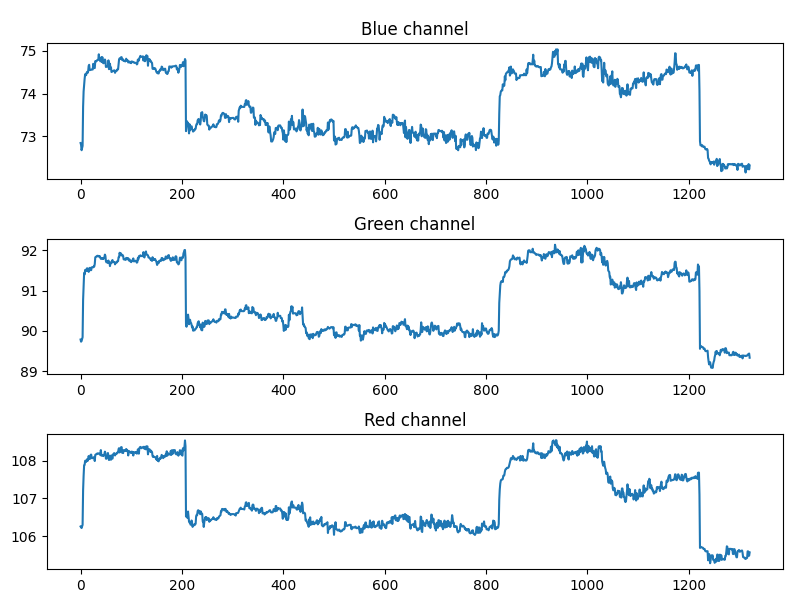
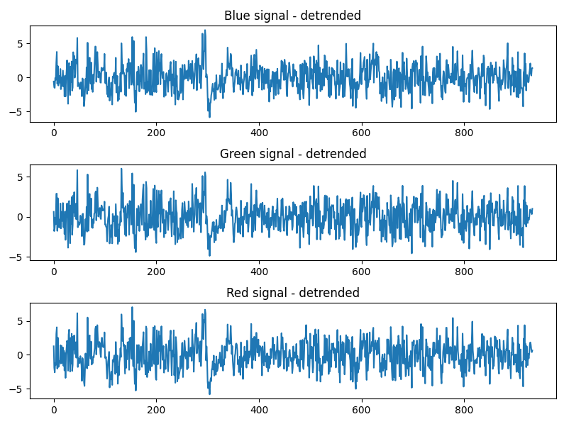
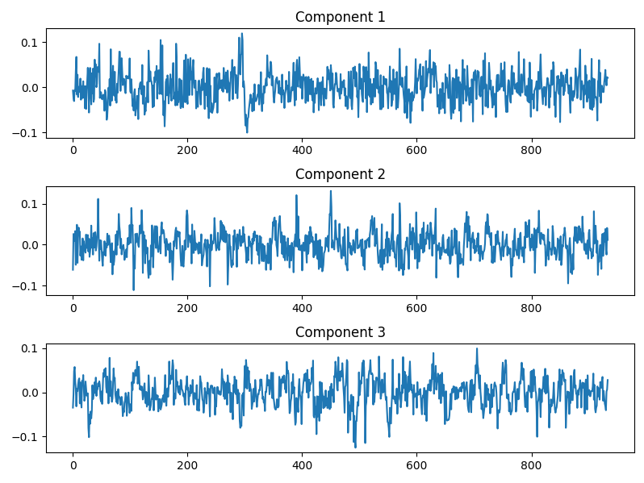
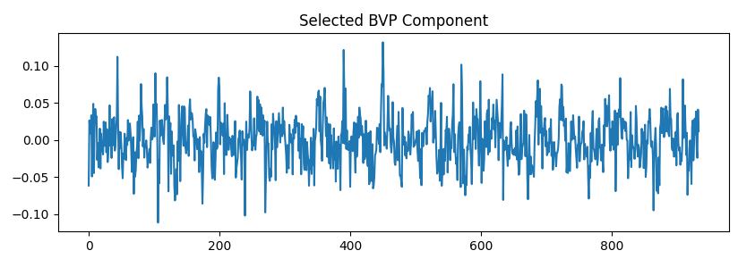
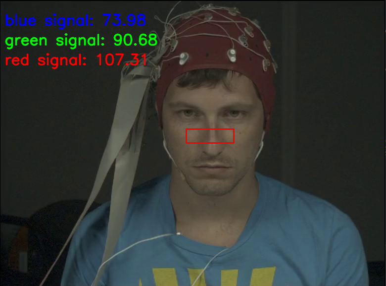

<html><head><meta content="text/html; charset=UTF-8" http-equiv="content-type"></head><body>
<h1 class="c38" id="h.v0rgan1jjm8x">Heart Rate Detection Using Remote Photoplethysmography</h1>
David Haas, Spencer Mullinix, Hogan Pope

Fall 2020 ECE 4554/5554 Computer Vision: Course Project

Virginia Tech

<h3 class="c11" id="h.itx3moozawen">Abstract</h3>
Currently heart rate is an attribute that can be incredibly difficult to measure without being in close proximity to the patient. However, by using modern Computer Vision techniques, a close approximation to heart rate can be discovered with nothing more than a live video feed. This paper details a remote photoplethysmography implementation utilizing Fourier techniques and Independent Component Analysis to estimate a subject&rsquo;s BVP signal, and furthermore their heart rate. We report moderate success, with an root mean square error of 6.76. Further work should explore real-time implementations of our algorithm, along with reducing the use of priors within our work.

<h3 class="c11" id="h.xrf0xh2mhh1x">Introduction</h3>
Finding a client&#39;s heart rate either for health, polygraph, or other reasons, is an issue that classically requires close proximity. However, with recent developments in remote photoplethysmography, this is no longer necessarily the case. If a stable version of this were deployed, it would allow for better remote healthcare work and improvements in other areas where being remote can help lower costs or increase availability. Our work only necessitates an RGB camera capable of recording video, as part of our goal is to make this capability available to as wide an array of people as possible. Hopefully being able to make them deployable on nearly all modern laptops, as well as potentially smartphones. One of the ways this issue has been approached in the past, specifically in the realm of smart phones, is through the use of fingerprint scanners. However, one of the benefits of being able to do this entirely via camera, is that while fingerprint scanners are becoming increasingly common in smartphones, they are all but non-existent in laptops, and many other devices that already have integrated cameras. Thus using only a camera would increase the domain of devices that could be supported.

<h3 class="c11" id="h.7d7oyvfa4dm0">Approach</h3>
We implemented an image processing pipeline aimed towards extracting a subject&#39;s blood volume pulse (BVP) signal, and from that, their pulse rate with a technique called remote photoplethysmography (rPPG). The algorithms are fed a video of a subject, and processed each frame of the video to extract time-indexed RGB vectors. The vectors then go through a pipeline of spectral and statistical analysis algorithms to extract a BVP signal, and from that, their heart rate.

The spectral method we have implemented is inspired by Poe et al. [1] and consists of roughly three portions: ROI detection, preprocessing and extraction, and pulse rate calculation. The first of which is aimed to calculate the location of the subject&#39;s face to measure the BVP signal. To maintain a robust sequence of measurements on a relatively static portion of the subject&rsquo;s face, we used the DLib facial landmark detector to extract the area between the subject&rsquo;s cheeks [2], illustrated in Figure 6. After their face has been segmented, each RGB channel in the face-image is averaged, resulting in one measurement per channel per frame in the video, producing three signals. These signals are illustrated in Figure 1. 

As heart rate signals are non-stationary, we then detrended these signals using a smoothness priors approach (Figure 2) with a cutoff frequency of 0.33 Hz [3]. After the RGB signals have been detrended and z-normalized, we use Independent Component Analysis (ICA) to decompose them into three independent source signals, shown in figure 3. To ensure that we could perform this step robustly and quickly, we opted to use scitkit-learn&rsquo;s FastICA implementation [4]. ICA separates color variations due to BVP from variations caused by motion, lighting, or other sources. One of the returned components represents the fluctuations in color caused by variations in blood volume; this is assumed to be the component with the largest peak in its power spectrum. An example of an extracted BVP signal is shown in figure 4.

We then filter the signal in the time and frequency domains with a 5 point moving-average filter and a hamming window bandpass filter with cut-off frequencies depending on the user&rsquo;s inputted state. We allow them to choose between resting, recovery, and active; each of which have different cut-off frequencies that incorporate prior estimates of their heart rate. Once the BVP signal is calculated, we use the interbeat-interval estimation implementation described in van Gent et al [5] to estimate the heart rate of the subject. We decided to utilize these authors&rsquo; implementations because the core focus of our project is on remotely estimating the BVP signal, not interbeat-interval estimation.

<h3 class="c11" id="h.wrh8w477mucc">Experiments</h3>

<h4 class="c28" id="h.hrzisetzxl4d">Experimental Methodology</h4>
Our testing approach consists of two phases of testing. The first phase consists of preliminary tests that test the initial operating capability of our project. Phase one tests the algorithm on data of people of the same skin tone, gender, with no facial hair, under ideal lighting conditions, with the test subject facing the camera straight on from a fixed distance. This methodology of testing will allow students to determine the algorithms operating capacity before other variables are introduced. Ideally, the second phase of testing would have introduced the variables that were fixed in the first phase. Each variable would have been changed independently of the rest to isolate that particular variable. This stage was unable to be completed due to lack of diverse data. The subjects available to us, for reasons that are explained in the data set section, were all white males between the ages of 18-25. One variable that was able to be added was facial hair.

This methodology for testing the algorithm would have allowed for complete testing of variables while isolating the faults. The algorithm will be considered successful if the algorithm can achieve &plusmn;5% in phase one.

<h4 class="c28" id="h.jspkfics25bl">Data Sets</h4>
<a class="c10" href="https://www.google.com/url?q=https://mahnob-db.eu/hci-tagging/&amp;sa=D&amp;ust=1605924449853000&amp;usg=AOvVaw2otoEVeXGkXObdtovgovgN">HCI tagging database</a>: This database is videos and images of 30 test subjects&#39; biometric reactions to stimuli. This dataset includes images and biometric data for these subjects.

<a class="c10" href="https://www.google.com/url?q=https://osf.io/fdrbh/wiki/home/&amp;sa=D&amp;ust=1605924449854000&amp;usg=AOvVaw3iL59UfplD1ue5Q_sh8iln">OSF rPPG</a>: This dataset covers provide RGB images and videos that are tagged with the foreground and background of the image as well as the biometrics of the people in the image. <a class="c10" href="https://www.google.com/url?q=https://www.idiap.ch/dataset/cohface&amp;sa=D&amp;ust=1605924449854000&amp;usg=AOvVaw2SGXCnlUYxvl4UvJS4vjop">COHFACE dataset</a>: This dataset consists of 160 minutes of 40 individuals of varying genders with tagged biometric data. The only downside to this database is that we will need assistance gaining access. After discovering the 

Collected Data: Eleven videos were taken of ten different people in ten different lighting conditions. Their heart-rates were taken using established ppg algorithms. These readings were used as ground truth for training.

Sadly, after further processing of the HCI data, including the unpackaging of EEG data, we discovered that while this database has a lot of useful biological information about patients, along with videos, it does not have the patient&#39;s heart rate, rendering this dataset useless. The other two major databases proved to be inaccessible given our lack of credentials as undergraduate students. So we had to rely entirely on the data we were able to collect ourselves. While useful, the PPG heart rate measurements we took of our subjects were only accurate to within two BPM, leading to the potential for significant error within our data, as well as the danger of overfitting due to lack of subjects. Additionally, due to covid restrictions in the time window we had to complete this project, we were unable to reach a diverse field of subjects to test our methods on, limiting us to white males between the ages of 18 and 25.

<h4 class="c28 c44" id="h.xod1gz9jovmz"></h4><h4 class="c28" id="h.hzudmkjon5s">Phase 1</h4>
Shown in figure 1 is the mapping of our heart rate measurements to the ground truth values and the trend between them. Ideally, the trendline will follow y = x.

Figure 1 - Experimental Results

Additionally, we compared our methods to other popular methods of RPPG(Remote Photoplethysmography) as seen in Figure 2 [6].

<table class="c32"><tbody><tr class="c37"><td class="c25" colspan="1" rowspan="1">

</td><td class="c13" colspan="1" rowspan="1">
Standard Deviation
</td><td class="c9" colspan="1" rowspan="1">
Mean Absolute Error
</td><td class="c26" colspan="1" rowspan="1">
Root Mean Square Error
</td></tr><tr class="c18"><td class="c25" colspan="1" rowspan="1">
Poh2011
</td><td class="c13" colspan="1" rowspan="1">
13.5
</td><td class="c9" colspan="1" rowspan="1">
-
</td><td class="c26" colspan="1" rowspan="1">
13.6
</td></tr><tr class="c18"><td class="c25" colspan="1" rowspan="1">
CHROM
</td><td class="c13" colspan="1" rowspan="1">
-
</td><td class="c9" colspan="1" rowspan="1">
13.49
</td><td class="c26" colspan="1" rowspan="1">
22.36
</td></tr><tr class="c18"><td class="c25" colspan="1" rowspan="1">
LI2014
</td><td class="c13" colspan="1" rowspan="1">
6.88
</td><td class="c9" colspan="1" rowspan="1">
-
</td><td class="c26" colspan="1" rowspan="1">
7.62
</td></tr><tr class="c18"><td class="c25" colspan="1" rowspan="1">
SAMC
</td><td class="c13" colspan="1" rowspan="1">
5.81
</td><td class="c9" colspan="1" rowspan="1">
4.96
</td><td class="c26" colspan="1" rowspan="1">
6.23
</td></tr><tr class="c18"><td class="c25" colspan="1" rowspan="1">
SynRhythm
</td><td class="c13" colspan="1" rowspan="1">
10.88
</td><td class="c9" colspan="1" rowspan="1">
-
</td><td class="c26" colspan="1" rowspan="1">
11.08
</td></tr><tr class="c18"><td class="c25" colspan="1" rowspan="1">
HR-CNN
</td><td class="c13" colspan="1" rowspan="1">
-
</td><td class="c9" colspan="1" rowspan="1">
7.25
</td><td class="c26" colspan="1" rowspan="1">
9.24
</td></tr><tr class="c18"><td class="c25" colspan="1" rowspan="1">
DeepPhys
</td><td class="c13" colspan="1" rowspan="1">
-
</td><td class="c9" colspan="1" rowspan="1">
4.57
</td><td class="c26" colspan="1" rowspan="1">
-
</td></tr><tr class="c18"><td class="c25" colspan="1" rowspan="1">
rPPPGNet
</td><td class="c13" colspan="1" rowspan="1">
7.82
</td><td class="c9" colspan="1" rowspan="1">
5.51
</td><td class="c26" colspan="1" rowspan="1">
7.82
</td></tr><tr class="c18"><td class="c25" colspan="1" rowspan="1">
Our Method
</td><td class="c13" colspan="1" rowspan="1">
4.26
</td><td class="c9" colspan="1" rowspan="1">
5.25
</td><td class="c26" colspan="1" rowspan="1">
6.76

</td></tr></tbody></table><h4 class="c41" id="h.jeilyf5a453g">Figure 2 - Table of Our method and other common methods error rates</h4>
Compared to many other methods our method has outstanding results, however, it is important to note that due to limiting factors, our data set was substantially smaller than what was used to find these values, consisting of only 10 subjects. All under similar conditions. However, this does seem to still indicate the effectiveness of our methods.

&nbsp;&nbsp;&nbsp;&nbsp;&nbsp;&nbsp;&nbsp;&nbsp;

The method we have presented has an error rate of approximately 7% which while higher than the goal of 5%, still indicates that this is a solid approach and potentially, that given more data, specifically, more accurate data, the approach shown could drop below 5% error.

<h4 class="c28" id="h.58yaoe9kt2dg">Special Test Cases</h4>
Test Case 1: Description

We performed an experiment measuring the effect of subject distance from the camera on the accuracy of the derived PPG signal, compared to a reference measurement from a pulse oximeter sensor. We believe that distance may influence accuracy, due to decreasing pixel density of the face-image as the subject moves further from the camera. To test this, we will record 30 second videos of the subject 0.5 meters from the camera, 1 meter from the camera, and 2 meters from the camera. Variables such as camera location, lighting, and video quality will be held constant. We expect that the derived PPG signals of further away subjects will have a higher signal-to-noise ratio, and thus be less accurate.

Test Case 1: Results
<table class="c5"><tbody><tr class="c29"><td class="c6" colspan="1" rowspan="1">
Distance from Camera
</td><td class="c6" colspan="1" rowspan="1">
0.5 M
</td><td class="c6" colspan="1" rowspan="1">
1.0 M
</td><td class="c6" colspan="1" rowspan="1">
2.0 M
</td></tr><tr class="c29"><td class="c6" colspan="1" rowspan="1">
Mean Absolute Error
</td><td class="c6" colspan="1" rowspan="1">
4.99
</td><td class="c6" colspan="1" rowspan="1">
2.1
</td><td class="c6" colspan="1" rowspan="1">
8.8
</td></tr></tbody></table>
There doesn&rsquo;t appear to be much of a difference within 1 meter but there is a noticeable change outside of 1 meter.

Test Case 2: Description

An experiment will be performed on the image quality that is necessary to get valid data. One of the main flaws of image processing is the general lack of resistance to lower resolution images. One of the tests will downsampling the testing images and compare the accuracy. The other image quality test will be image resolution. This will involve downsampling the testing images to different degrees and taking metrics at each step. The expected performance in this situation is decreased accuracy. The goal is to determine how robust the algorithm is. This will be achieved by incrementally testing by downsampling and comparing the results.

Test Case 2: Results
<table class="c5"><tbody><tr class="c29"><td class="c6" colspan="1" rowspan="1">
Image Resolution
</td><td class="c6" colspan="1" rowspan="1">
540p
</td><td class="c6" colspan="1" rowspan="1">
720p
</td><td class="c6" colspan="1" rowspan="1">
1080p
</td></tr><tr class="c29"><td class="c6" colspan="1" rowspan="1">
Mean Absolute Error
</td><td class="c6" colspan="1" rowspan="1">
4.5
</td><td class="c6" colspan="1" rowspan="1">
2.6
</td><td class="c6" colspan="1" rowspan="1">
4.8
</td></tr></tbody></table>
It appears that there is a sweet spot for accuracy at 720p where it is more effective than 540p and 1080p. This is unexpected. Possible reasons is that the downsampling removes some noise but maintains enough information. More testing would be needed to be determined
<h3 class="c11 c36" id="h.j5q4k54vg0qk"></h3>
Initial Experiments: Facial Recognition

&nbsp; &nbsp; The project revolves around facial recognition, so it was imperative that this portion be prioritized. Currently, the software takes the input of a xml data from the HCI Tagging Dataset. This data is then parsed for faces using OpenCV. Then a bounding box is drawn around the center. The center of the face was decided to be used based off of previous projects in the same field as ours. The center of the face seemed to provide good data while limiting the outside factors. Once the bounding box is drawn the average RGB value for each color channel within the box is saved. This process is repeated for every frame of the video. Each color channel is saved off as a signal after the video has finished being processed as shown below.

Figure 1 - Raw RGB Signals

Initial Experiments: Signal Filtering

Detrended RGB signal data
<h3 class="c11" id="h.uzr0qtlnguec"></h3>
Figure 2 - Detrended and normalized RGB signals

Independent component analysis (ICA) was performed on the color channel signals. Independent component analysis is a method of taking input signals then breaking them down into the components that make up those signals. The data above labeled &ldquo;Detrended RGB signal data&rdquo; was input into an ICA algorithm and the output is shown below.

<h3 class="c11" id="h.ktwkhy9vr2rl"></h3>
Figure 3 - ICA components

Below is an ICA component, which our algorithm has determined to be the most likely BVP signal. The signal chosen has the largest magnitude within our bandpass frequencies, discussed in the approach. 
<h3 class="c19" id="h.73pdyck9zoe0"></h3>
Figure 4 - The ICA component selected as our BVP Signal

After a signal is chosen from ICA, a bandpass filter is applied to eliminate high and low frequency noise. This can be done because a heart beat is typically between 0.7-4.0 Hz [1].
<h3 class="c11" id="h.h4iv4bnw3ghg"></h3>
Figure 5 - Bandpass filtered BVP signal

Once the bandpass filtered BVP signal is created, we implemented a library by the name of heartpy, which was designed for PPG type signals. It uses the root mean square of successive differences (RMSSD) along with the standard deviation of successive differences (SDSD) to find the heart rate hidden in a signal [7].

<h3 class="c11" id="h.7qznsxyw9pii">Qualitative results</h3>
We detail many of our results in the experiments section. However, there are a few results worth discussing in this section as well.

Figure 6 shows a visualization we developed that runs while our algorithm extracts RGB data. The red box shows the ROI over which the average red, blue, and green signals are extracted from. We calculate this ROI using the dlib library [8] for facial detection, we also use this library for predicting facial landmarks. We use landmarks identified along the jawline, and then shrink the region to give us an area below the eyes that&rsquo;s all skin. Which will hopefully eliminate as much noise as we can.

Figure 6 - A screenshot of the algorithm extracting color data from the subject

<h3 class="c11" id="h.86hwqjfzdq5b">Conclusion</h3>
This report has described an overview of our approach for remote photoplethysmography. We utilize a variety of signal processing and statistical techniques to remotely extract a heart rate signal from a patient. The basic pipeline is as follows: extract color signals from a face within a video, filter them and separate them into independent source signals, determine which source signal is the subject&rsquo;s BVP, and estimate their heart rate from that signal. To accomplish this, we wrote a program in Python that incorporates much of our own work mixed with supporting libraries from reputable authors.

Although our implementation is complete, it is not perfect. Future work should investigate estimating heart rate without the use of priors about the subject&rsquo;s activity levels, as one&rsquo;s heart rate may not always fall within the bounds suggested by their activity level. Furthermore, our algorithm processes video at about 3 frames per second, so it would be difficult to implement it online. Real-time heart rate estimates are of much use to physicians and other concerned parties, so this would be a useful expansion of our work.

<h3 class="c11" id="h.ot41mmqx0vp2">Citations</h3>
1. Poh, M.-Z., McDuff, D.J., Picard, R.W.: Advancements in noncontact, multiparameter physiological measurements using a webcam. IEEE Trans. Biomed. Eng. 58, 7&ndash;11 (2011)

2. Davis E. King. Dlib-ml: A Machine Learning Toolkit. Journal of Machine Learning Research&nbsp;10, pp. 1755-1758, 2009

3. M. P. Tarvainen, P. O. Ranta-Aho, and P. A. Karjalainen, &ldquo;An advanced detrending method with application to HRV analysis,&rdquo; IEEE Trans. Biomed. Eng., vol. 49, no. 2, pp. 172&ndash;175, Feb. 2002.

4. Scikit-learn: Machine Learning in Python, Pedregosa et al., JMLR 12, pp. 2825-2830, 2011.

5. van Gent, P., Farah, H., van Nes, N. and van Arem, B., 2019. Analysing Noisy Driver Physiology Real-Time Using Off-the-Shelf Sensors: Heart Rate Analysis Software from the Taking the Fast Lane Project. Journal of Open Research Software, 7(1), p.32. DOI: <a class="c10" href="https://www.google.com/url?q=http://doi.org/10.5334/jors.241&amp;sa=D&amp;ust=1605924449886000&amp;usg=AOvVaw0K8RmWyukkeN8rAJbCpYTM">http://doi.org/10.5334/jors.241</a>

6. Zitong Yu, Wei Peng, Xiaobai Li, Xiaopeng Hong, Guoying Zhao, Center for Machine Vision and Signal Analysis, University of Oulu, Finland, MOE Key Lab. for Intelligent Networks and Network SecurityFaculty of Electronic and Information Engineering, Xi&rsquo;an Jiaotong University, PRC School of Information and Technology , Northwest University, PRC, &ldquo;Remote Heart Rate Measurement from Highly Compressed Facial Videos: anEnd-to-end Deep Learning Solution with Video Enhancement&rdquo;, <a class="c10" href="https://www.google.com/url?q=https://arxiv.org/pdf/1907.11921.pdf&amp;sa=D&amp;ust=1605924449886000&amp;usg=AOvVaw0sAxY9JDNVX8UeW2lELd2k">https://arxiv.org/pdf/1907.11921.pdf</a>

7. van Gent, Paul &amp; Farah, Haneen &amp; Nes, Nicole &amp; Arem, B.. (2018). Heart Rate Analysis for Human Factors: Development and Validation of an Open Source Toolkit for Noisy Naturalistic Heart Rate Data.

8. Davis E. King.<a class="c10" href="https://www.google.com/url?q=http://jmlr.csail.mit.edu/papers/volume10/king09a/king09a.pdf&amp;sa=D&amp;ust=1605924449887000&amp;usg=AOvVaw2_r2BehTx47xN9i4OPInJi">&nbsp;</a><a class="c10" href="https://www.google.com/url?q=http://jmlr.csail.mit.edu/papers/volume10/king09a/king09a.pdf&amp;sa=D&amp;ust=1605924449887000&amp;usg=AOvVaw2_r2BehTx47xN9i4OPInJi">Dlib-ml: A Machine Learning Toolkit</a>. Journal of Machine Learning Research&nbsp;10, pp. 1755-1758, 2009

&copy; David Haas, Spencer Mullinix, Hogan Pope

</body></html>
